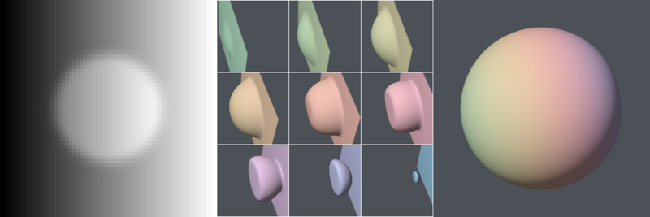

# Figure 5: Volume rendering Canny edges

In [the paper](http://people.cs.uchicago.edu/~glk/pubs/#VIS-2015),
Figure 5 used a CT scan of a capuchin monkey head; this data is not
publicly available.  However, the [paper
presentation](http://people.cs.uchicago.edu/~glk/pubs/pdf/Kindlmann-Diderot-VIS-2015-talk.pdf)
used a synthetic dataset to illustrate the same basic point; that
Canny edges can show structure where isocontours fail. The first step here
recreates that synthetic data using the
[`fs3d-scl`](https://github.com/Diderot-Language/examples/tree/master/fs3d)
example program.

Running (in this order):

	./1-dataprep.sh
	./2-vr-iso.sh
	./3-vr-canny.sh
	./4-arrange.sh
	# ./5-cleanup.sh  # (optional)

should produce:

* (from [`1-dataprep.sh`](1-dataprep.sh)) `vol.nrrd` synthetic dataset of a spherical bright region with a superimposed
linear ramp, a slice of which is shown in [`A-canny-slice.png`](ref/A-canny-slice.png).
* (from [`1-dataprep.sh`](1-dataprep.sh)) `cmap.nrrd` colormap and its image preview ,
in case that's of any use.
* (from [`2-vr-iso.sh`](2-vr-iso.sh)) Nine isosurface images [`C-vr-iso-0.png`](ref/C-vr-iso-0.png) through
[`C-vr-iso-9.png`](ref/C-vr-iso-9.png).
* (from [`3-vr-canny.sh`](3-vr-canny.sh)) Canny edge rendering [`D-vr-canny.png`](ref/D-vr-canny.png).
* (from [`4-arrange.sh`](4-arrange.sh)) Combined image [`Figure05.png`](ref/Figure05.png) and smaller preview
[`Figure05-sm.png`](ref/Figure05-sm.png) and smaller preview:  

This example shows how the program that was printed in the paper,
[`../volrend.diderot`](../volrend.diderot) is transformed to do
different things, as described in Section 4.1 of the paper.
The program source indicates the small changes from what was published;
this includes typo fixes, and filename changes.  This is true of other
programs for most other figures: with no or only superficial changes, the
published programs can be used to regenerate the published figures.

