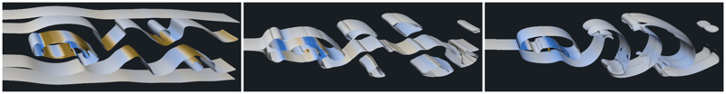

# Figure 6: Volume rendering flow properties

Running (in this order):

	./1-dataprep.sh
	./2-vr-all.sh
	./3-arrange.sh
	# ./4-cleanup.sh  # (optional)

should produce:

* (from [`1-dataprep.sh`](1-dataprep.sh)) `flow.nrrd` which is slightly smoothed a copy of
`sqflow-1608.nrrd` from https://github.com/Diderot-Language/examples/tree/master/data
* (from [`2-vr-all.sh`](2-vr-all.sh)): [`A-flow-MAG.png`](ref/A-flow-MAG.png) [`B-flow-EXT.png`](ref/B-flow-EXT.png) [`C-flow-NHL.png`](ref/C-flow-NHL.png)
renderings of isosurfaces of flow magnitude, extremal speed, and normalized helicity.
* (from [`3-arrange.sh`](3-arrange.sh)): all images side-by side [`Figure06.png`](ref/Figure06.png), and low-res preview
[`Figure06-sm.png`](ref/Figure06-sm.png):  

Be warned that a very small ray step size is needed for part c (normalized helicity), which means
it takes a few minutes to render.

