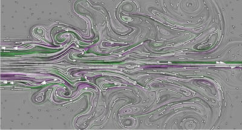

# Figure 10: LIC and streamlines in 2D flow

Running (in this order):

	./1-dataprep.sh
	./2-lic.sh
	./3-sline.sh
	# ./4-cleanup.sh (optional)

should produce:

* (from [`1-dataprep.sh`](1-dataprep.sh)) `rand.nrrd` noise texture, and `seeds.txt` seedpoints for streamlines
* (from [`2-lic.sh`](2-lic.sh)) `lic2d.png` 8-bit LIC result from [`lic2d.diderot`](lic2d.diderot)
* (from [`3-sline.sh`](3-sline.sh)) Computes streamlines with [`sline.diderot`](sline.diderot), and uses
the stand-alone [`../epsdraw`](../epsdraw.c) utility for drawing paths over an image, to
make [`Figure10.pdf`](ref/Figure10.pdf). This is rasterized in preview [`Figure10-sm.png`](ref/Figure10-sm.png):  

The LIC computation is the one case where the published program is not
used here for figure reproduction: it had little documentation,
various hard-coded constants, and not enough input variables to be
useful on anything other than one specific dataset.  Also, its
computation of the expected standard deviation of the (floating-point) LIC output was
incomplete. Still, for reference, the printed program is available as
[`lic2d-published.diderot`](lic2d-published.diderot), and the comments therein document
how it can be used to make a LIC image like the one in the paper.  The
[`lic2d.diderot`](lic2d.diderot) program here is better tested and
documented.
