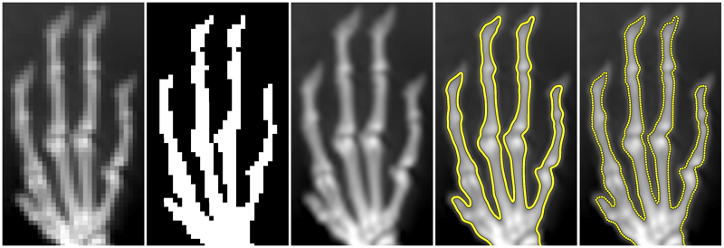
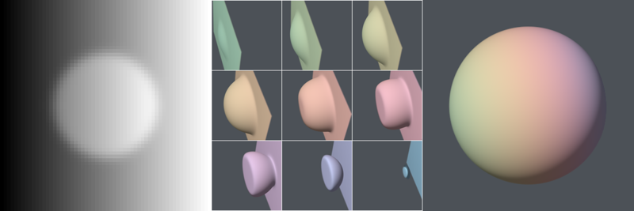
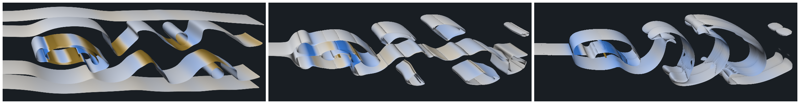
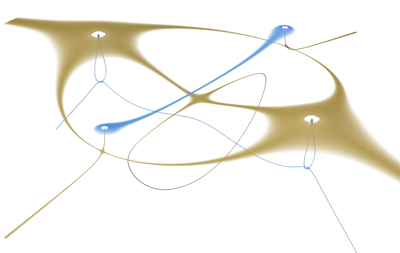
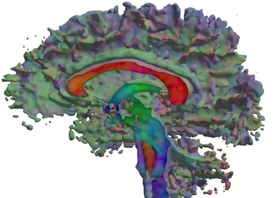
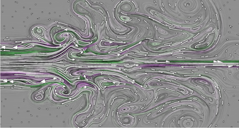

# vis15: Reproducing VIS'15 Diderot Paper Figures

This page documents how to reproduce the
Diderot-generated figures in the [VIS 2015
paper](http://people.cs.uchicago.edu/~glk/pubs/#VIS-2015) about
Diderot.  In most cases, the figures can be reproduced
by compiling and running the Diderot programs that appeared within the
published paper, modulo typo fixes and other superficial changes.  Where
the figures used data that was not publicly available, this shows how to
make a related figure with public or synthetic data.

The figures are listed here, and below are more details about running
the scripts. Please ask questions about these instructions, and give feedback,
in the [diderot-language Google group](https://goo.gl/kXpxhV).

  
[(00-cmap) Needed for other figures: colormap generation](00-cmap)

  
[(01-mousehand) Figure 1: 2D image data, field, and isocontours](01-mousehand)

Figure 2: Listing of [`isoptcl.diderot`](01-mousehand/isoptcl.diderot) program for
uniformly sampling a 2D isocontour with a system of interacting particles.

(Figure 3: Diagram of bulk synchronous parallel (BSP) execution model)

Figure 4: Listing of [`volrend.diderot`](volrend.diderot) program for
volume rendering a scalar field, which is modified (as described in Section 4.1)
to produce Figures 5, 6, and 7.

  
[(05-canny) Figure 5: Volume rendering Canny edges](05-canny)

  
[(06-vrflow) Figure 6: Volume rendering flow properties](06-vrflow)

  
[(07a-vrstress) Figure 7a: Volume rendering stress tensors](07a-vrstress)

  
[(07b-vrdti) Figure 7b: Volume rendering diffusion tensors](07b-vrdti)

Figure 8: Listing of [`lic2d-published.diderot`](10-2dflow/lic2d-published.diderot) program for
doing line integral convolution (LIC) in a vector field; see [Figure 10](10-2dflow).

Figure 9: Listing of [`sline.diderot`](10-2dflow/sline.diderot) program for
computing streamlines in a vector field; see [Figure 10](10-2dflow).

  
[(10-2dflow) Figure 10: LIC and streamlines in 2D flow](10-2dflow)

(Figure 11: A comparison of parallel speedup on benchmark programs)

Running these programs requires some set-up (this is checked in 0-common.sh):
* These Diderot programs depend on the `vis15` branch of the compiler
(called `diderotc`), which can be built by [following these
directions](https://github.com/Diderot-Language/examples)
(search for: Building Diderot and these examples).  **You will need to
add the vis15 `diderotc` to your path**.
* The scripts assume that you have built Teem from its latest source.
August 2017 updates (revision r6319) added the ability, used in these scripts, to specify
gamma to `unu quantize` and `overrgb` with `-g srgb`.  Following the
[Diderot build instructions](https://github.com/Diderot-Language/examples),
**you should add `$DDRO_ROOT/teem-util` to your path** so that you have
the latest `unu` and `overrgb`.
* The `epsdraw.c` program has to be compiled (and linked with Teem) to
create some of the figures.  This depends on setting environment variable
`TEEM_INSTALL`.  If you've followed the Diderot build instructions, you
can do this with (in bash): `export TEEM_INSTALL=$DDRO_ROOT/teem-util`.
* Some of the programs assume that you have [`epstopdf`](https://www.ctan.org/pkg/epstopdf)
and [`convert`](http://www.imagemagick.org) in your path.
* Finally, some of the figures use data or programs from the Diderot examples
themselves, so **you should set environment variable `DDRO_EXAMPLES` to the
path of your checkout of https://github.com/Diderot-Language/examples**

While Diderot is used as the computational core for all the figures,
various pre- and post-processing steps are also needed. Gordon
Kindlmann (GLK) uses `bash` and `unu` for these steps, because GLK's
day-to-day work uses `bash` and `unu` for command-line data hacking,
and also because pieces of image metadata (in NRRD files) that Diderot
relies on can be easily manipulated with `unu`.  With time, we may
develop comparable solutions based on python or IPython, or other
GUI-based tools that exploit how Diderot programs can be compiled to
libraries.

Thus, each figure is made with a fairly low-tech
sequence of scripts, each starting with an integer (such as, in `05-canny`,
`1-dataprep.sh`, `2-vr-iso.sh`, `3-vr-canny.sh`, and then `4-cleanup.sh`).
These scripts should be run in sequence (with no
additional command-line arguments), though the final `N-cleanup.sh` script
is optional.  All the scripts have detailed
comments to describe what is going on, as well commentary to explain
the various (generally superficial) differences between what was in
the paper, and what is generated here.  Some additional commentary
is within the Diderot programs.  The intended final output of the scripts
is saved in the `ref` subdirectory of each per-figure directory.
